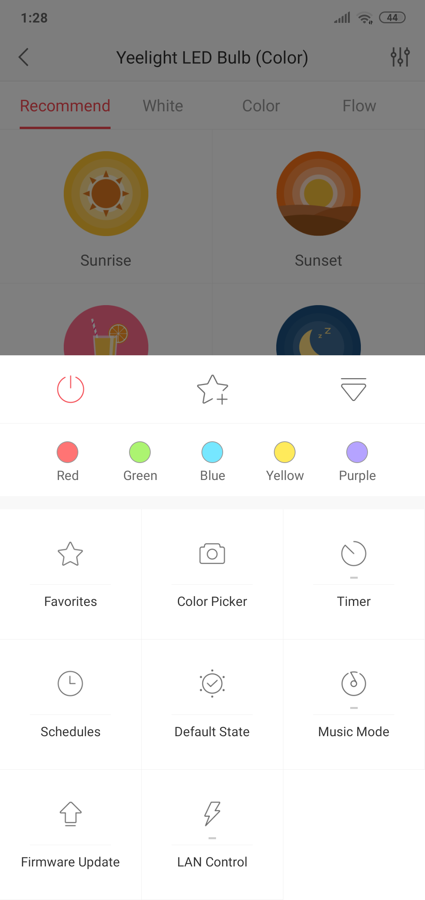
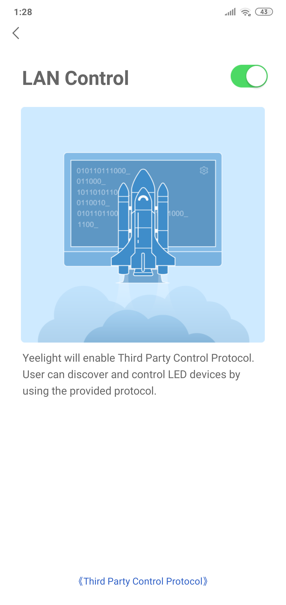

# :bulb: Yeelight control
<h1 align="center">
    
</h1>
<h4 align="center">
    Control your Yeelight lamp on your desktop
</h4>

---

## :exclamation: Enable LAN Control

- Check LAN control

<h4>
    
    
</h4>

-----

## Run

> Make sure you have **Node.js** and **Yarn** installed.

In the ``master`` directory run:

```
$ yarn install
$ yarn start
```

---

*Made with Electron by Renan Arques*